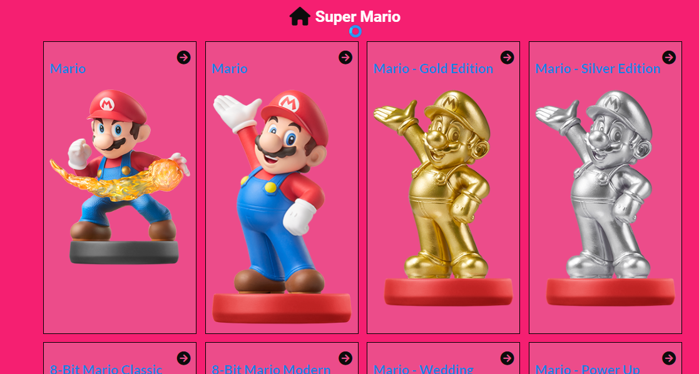

<div align="center">

  
  <br/>

  <h3><b>Super Mario</b></h3>

</div>

# 📗 Table of Contents

- [📗 Table of Contents](#-table-of-contents)
- [📖 Fullstack Development ](#-fullstack-development-)
    - [SuperMario is your ultimate companion for all things Mario. Stay connected to the information and games like never before with our comprehensive app. Explore release dates check 3Ds Games, dive into information relating to the release date , and get the latest information and  news from around the world—all in one App.](#supermario-is-your-ultimate-companion-for-all-things-mario-stay-connected-to-the-information-and-games-like-never-before-with-our-comprehensive-app-explore-release-dates-check-3ds-games-dive-into-information-relating-to-the-release-date--and-get-the-latest-information-and--news-from-around-the-worldall-in-one-app)
  - [🛠  Built With ](#--built-with-)
    - [Key Features ](#key-features-)
  - [🚀 Live Demo ](#-live-demo-)
  - [🚀 video presentation ](#-video-presentation-)
  - [💻 Getting Started ](#-getting-started-)
    - [Prerequisites](#prerequisites)
    - [Setup](#setup)
    - [Usage](#usage)
  - [👥 Authors ](#-authors-)
  - [🔭 Future Features ](#-future-features-)
  - [🤝 Contributing ](#-contributing-)
  - [⭐️ Show your support ](#️-show-your-support-)
  - [🙏 Acknowledgments ](#-acknowledgments-)
  - [❓ FAQ ](#-faq-)
  - [📝 License ](#-license-)


# 📖 Fullstack Development <a name="SuperMario"></a>

### SuperMario is your ultimate companion for all things Mario. Stay connected to the information and games like never before with our comprehensive app. Explore release dates check 3Ds Games, dive into information relating to the release date , and get the latest information and  news from around the world—all in one App.

## 🛠  Built With <a name="built-with"></a>
- HTML
- SCSS
- JavaScript
- React
- Redux
### Key Features <a name="key-features"></a>

- The project is a single-page application (SPA) built with React and Redux.
- The data retrieved from the [API](https://www.amiiboapi.com/api/amiibo/?name=mario) is stored in the Redux store.
- Each page has a unique route

## 🚀 Live Demo <a name="live-demo"></a>

- [Live Demo](https://richardsmarioinfo.netlify.app/)

## 🚀 video presentation <a name="video-presentation"></a>

- [ video presentation ](https://www.loom.com/share/7560711542d5401c8523acdade5bd0b0?sid=99b37e01-0364-4cf0-b0b6-ae6c6d0d2831)

<p align="right">(<a href="#readme-top">back to top</a>)</p>

## 💻 Getting Started <a name="getting-started"></a>

### Prerequisites

In order to run this project you need:

### Setup

Clone this repository to your desired folder:
```sh
  git clone https://github.com/richie1988/SuperMario.git
```
### Usage

To run the project, execute the following command:

```sh
  cd  WORLD-DATA/SUPER-MARIO
  npm install
  npm run build
  npm run start
```

<p align="right">(<a href="#readme-top">back to top</a>)</p>


## 👥 Authors <a name="authors"></a>

👤 **Richard Sikaonga**
- GitHub: [@githubhandle](https://github.com/richie1988)
- Twitter: [@twitterhandle](@RICHARDSIK51272)
- LinkedIn: [LinkedIn](in/richard-sikaonga-039940275)

<p align="right">(<a href="#readme-top">back to top</a>)</p>


## 🔭 Future Features <a name="future-features"></a>

- [ ] **Add responsive layouts**

<p align="right">(<a href="#readme-top">back to top</a>)</p>

## 🤝 Contributing <a name="contributing"></a>

Contributions, issues, and feature requests are welcome!

Feel free to check the [issues page](https://github.com/richie1988/SuperMario/issues).

<p align="right">(<a href="#readme-top">back to top</a>)</p>


## ⭐️ Show your support <a name="support"></a>

If you like this project, please consider subscribing to my GitHub account for updates and more projects

<p align="right">(<a href="#readme-top">back to top</a>)</p>


## 🙏 Acknowledgments <a name="acknowledgements"></a>
- In God I Trust
- [Microverse Team](https://www.microverse.org/).

<p align="right">(<a href="#readme-top">back to top</a>)</p>

## ❓ FAQ <a name="faq"></a>

- **Can I run this project run on Docker?**

  - yes

<p align="right">(<a href="#readme-top">back to top</a>)</p>

## 📝 License <a name="license"></a>

This project is [MIT](./LICENSE) licensed.

<p align="right">(<a href="#readme-top">back to top</a>)</p>
